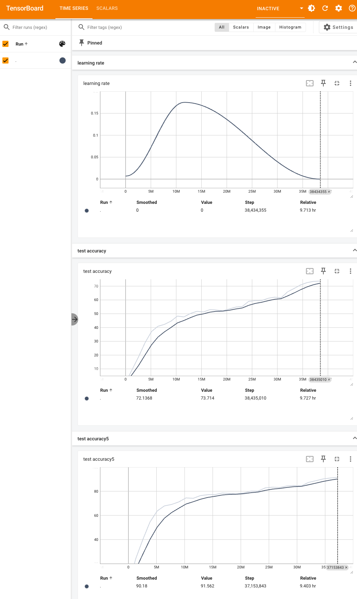
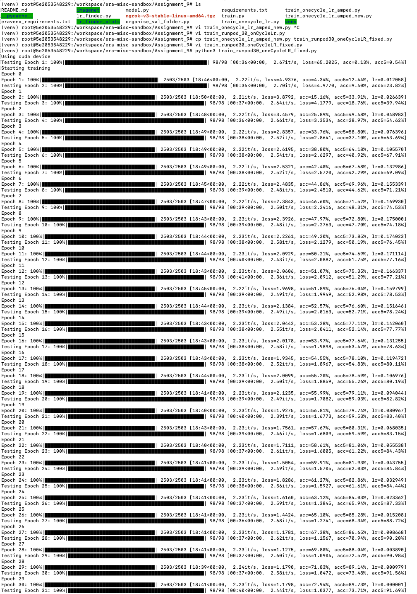
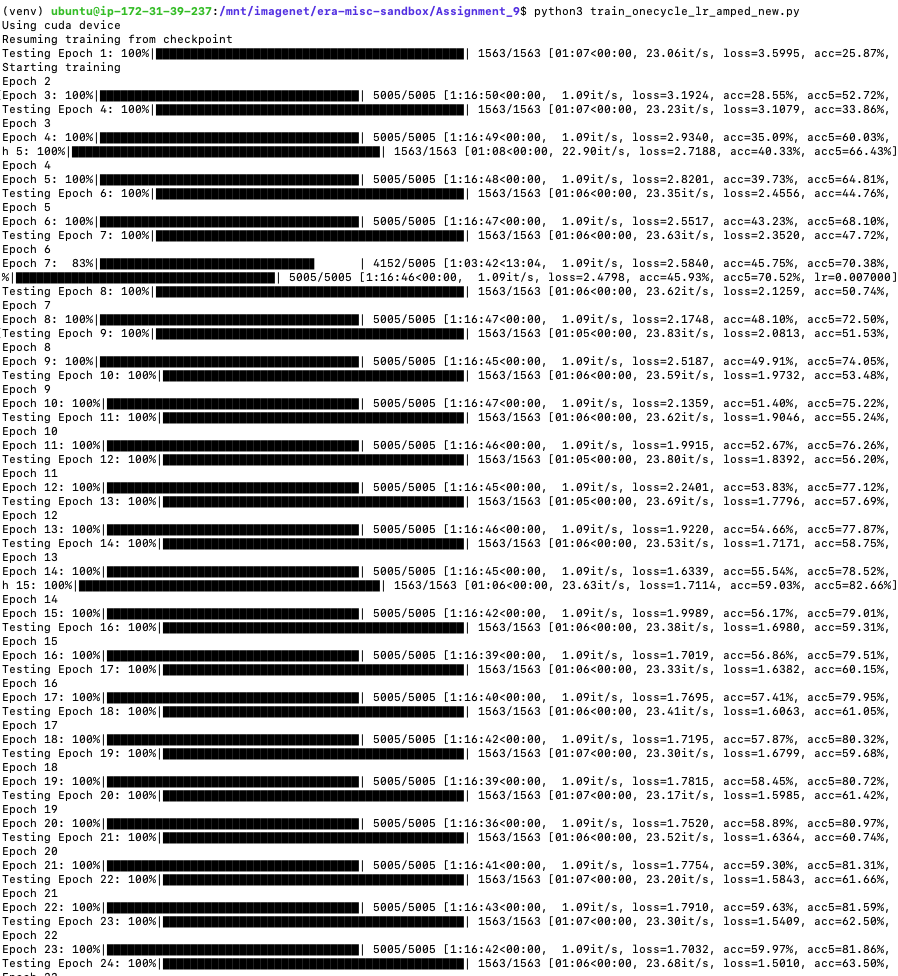
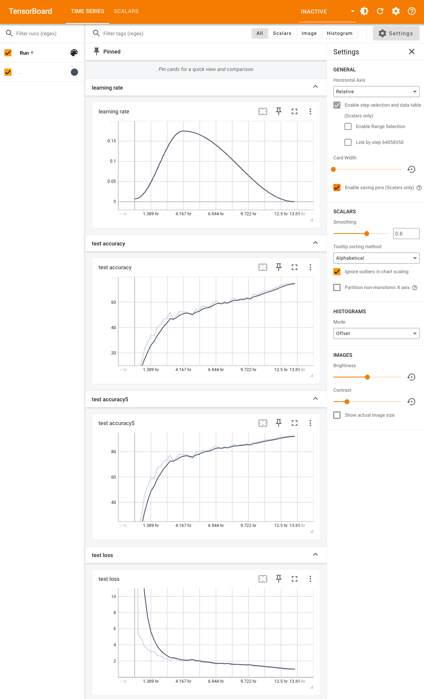
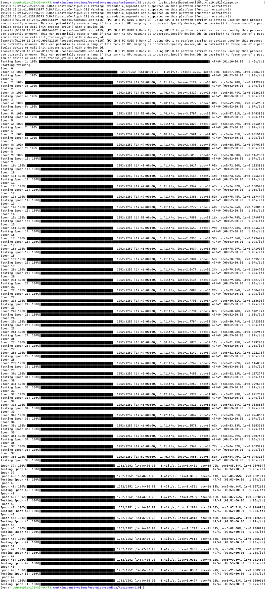
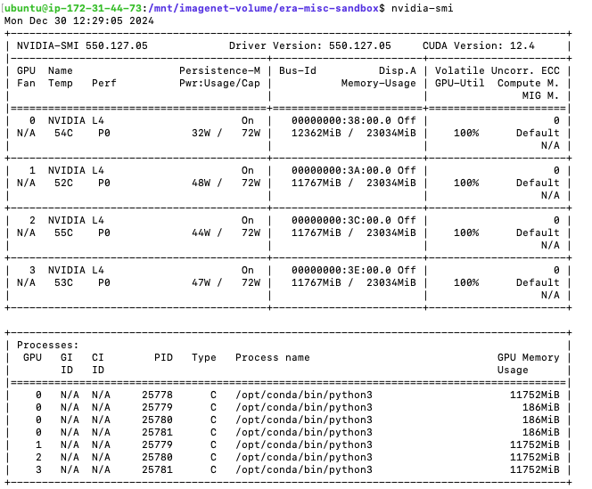

# ImageNet ResNet50 TSAI

This is a PyTorch implementation of training a ResNet50 model from scratch on the ImageNet-1K dataset, as part of The School of AI Session 9 Assignment.

## About ImageNet

ImageNet is a large dataset of images with over 14 million images and 22,000 categories. For this project, we used ImageNet-1K, a subset containing 1000 categories that has become a standard benchmark in computer vision.

## Training Infrastructure & Process

### RunPod.io Training

**Setup:**
- Network Volume: 500GB for ImageNet-1K dataset storage
- GPU: NVIDIA RTX 6000 Ada Generation
- Cost: ~$15 for the training run
- Training Time: ~18.5 minutes per epoch (30 epochs total)

**Training Optimizations:**
- Mixed Precision Training (FP16)
- One Cycle Learning Rate Policy
- Learning Rate found using LR Finder

**Learning Rate Finding: Arriving at 0.175**

<div style="display: flex; justify-content: space-between; align-items: center;">
  
  
  
</div>

**Training Monitoring:**
- Used Tensorboard with ngrok for real-time monitoring via public URL access to training metrics



**Training Logs (runpod.io):**




### AWS Training Experiments

**Initial Setup:**
- Infrastructure: EBS Volume for dataset
- Instance: g4dn.4xlarge
- Performance: ~1.2 hours per epoch (with mixed precision)

**Training Logs: AWS EC2**


**Stopped After 24 Epochs as I focussed on training with runpod (machine burning my hard-earned 💰 ) and requested for more cores 48 for G and V types and also requested for P type on AWS**

**It was time for Distributed Training:**
- Got Approved for 32 cores P-series GPU quota, but guess what, they do not have P3 type in Mumbai region means no V100 volta fun 😢  
- As an alternative, made use of the extra approved cores for G type and provisioned a g512x large


- Target Hardware: g512xlarge instances with Multiple, (4) Nvidia L4 GPUs.

**Setup:**
- Network Volume: 500GB for ImageNet-1K dataset storage
- GPU: 4 NVIDIA L4 with g512xlarge instance
- Cost: ~$15 for the training run
- Training Time: ~14.9 minutes per epoch (50 epochs total)

**Training Optimizations:**
- Mixed Precision Training (FP16)
- One Cycle Learning Rate Policy
- Learning Rate found using LR Finder
- Distributed training by wrapping model on device with DPP, using only rank 0 gpu for all the overall updates of logs and events

**Training Monitoring:**
- Used Tensorboard with ngrok for real-time monitoring via public URL access to training metrics



**Training Logs (EC2 distributed):**




**GPU utilization in distributed training**
g512xlarge - 4 NVIDIA L4



## Model Architecture

ResNet50 consists of 48 Convolutional layers, 1 MaxPool layer, and 1 Average Pool layer, followed by a fully connected layer. The model uses skip connections to solve the vanishing gradient problem.

Key components:
- Input: 224x224x3 images
- Output: 1000 classes (ImageNet-1K)
- Total Parameters: 25.6M

## Training Configuration

```python
class Params:
    def __init__(self):
        self.batch_size = 256
        self.name = "resnet_50_onecycle"
        self.workers = 12
        self.max_lr = 0.175  # Maximum learning rate as per lr finder
        self.momentum = 0.9
        self.weight_decay = 1e-4
        self.epochs = 30 # 50 for the EC2 distributed
        self.pct_start = 0.3  # Percentage of training where LR increases
        self.div_factor = 25.0  # Initial LR = max_lr/div_factor
        self.final_div_factor = 1e4  # Final LR = max_lr/final_div_factor
```


## Model Deployment

The trained model is deployed on Hugging Face Spaces and can be accessed at: [ResNet50 Explorer](https://huggingface.co/spaces/Perpetualquest/ResNet-Explorer)


## Future Work

1. Complete distributed training on AWS P2 instances
